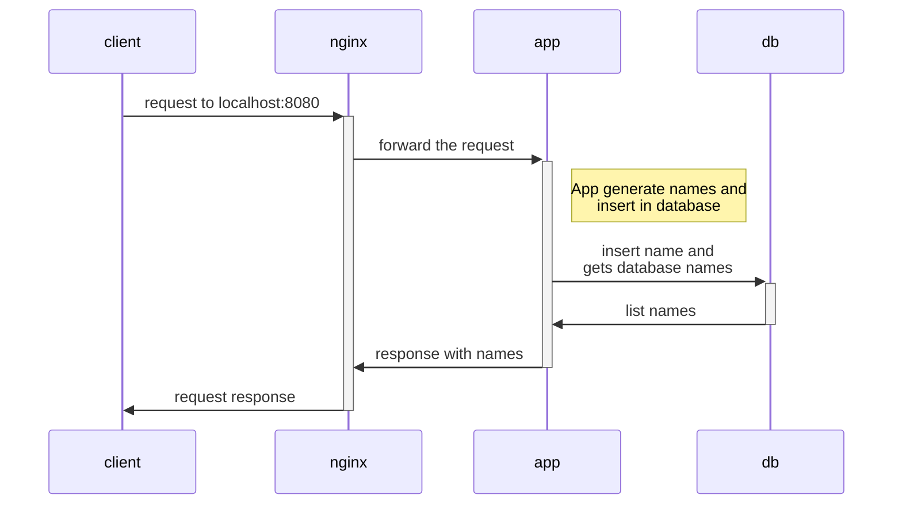
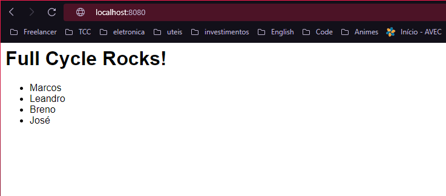

# 🆖✖🟩 Dasafio Nginx com Node.js

## Enuciado do desafio

Nesse desafio você colocará em prática o que aprendemos em relação a utilização do nginx como proxy reverso. A idéia principal é que quando um usuário acesse o nginx, o mesmo fará uma chamada em nossa aplicação node.js. Essa aplicação por sua vez adicionará um registro em nosso banco de dados mysql, cadastrando um nome na tabela people.

O retorno da aplicação node.js para o nginx deverá ser:

`<h1>Full Cycle Rocks!</h1>`

- Lista de nomes cadastrada no banco de dados.

Gere o docker-compose de uma forma que basta apenas rodarmos: docker-compose up -d que tudo deverá estar funcionando e disponível na porta: 8080.

Suba tudo em um repositório e faça a entrega.

* A linguagem de programação para este desafio é Node/JavaScript.

## Explicação sobre o projeto

Esse projeto consiste na geração de 3 imagens docker, uma para o banco de dados, baseado em My SQL, uma para a API, que é escrita em NodeJS, e outra para o nginx
que serve como proxy reverso para disponibilização de comunicação com a API.

O fluxo de comunicação entre os contêineres é da seguinte forma:



Foi adicionada uma lógica para a geração de alguns nomes de forma randômica, assim serão inserido no banco de dados alguns nomes diferentes.

## Comando subir os contêineres

Esse projeto possui um arquivo `docker-compose.yaml` que defini as configurações das imagens das aplicações. Para subir os contêiners basta executar o comando abaixo:

```
docker-compose up -d
```

Após a subida dos contêiners e a realização de conexão entre a API e o banco de dados, pode ser chamado o endereço: `http:localhost:8080` que a API irá responder com os nomes que foram inseridos no banco de dados. Como mostra a imagem abaixo:



A cada requisição à API será inserido um novo nome no banco e retornado a lista para o cliente que fez a requisição.
